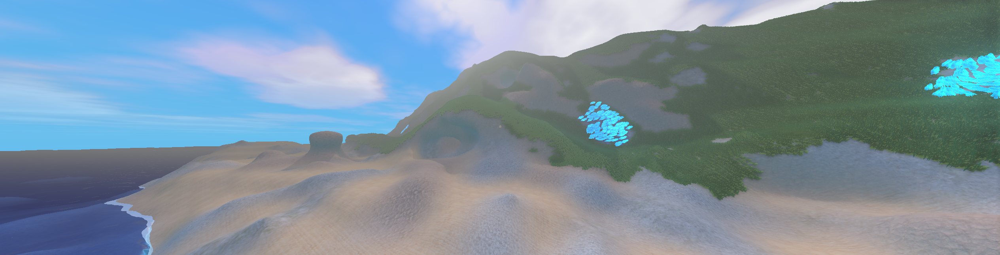

# Godot marching cubes

This is a demo of multiplayer marching cubes game in godot.

# Features

- Procedural world generation with biomes
- Blending different materials
- Water
- Day night cycle
- Multiplayer
- Voxel placing and removing

# Testing

- To run the project open it in godot and run it, two windows will open. 
- In one window you can enter singleplayer, the other is to test multiplayer. 
- Connect to the singleplayer world using port 5000.

# Adding new voxels

- Create a new class that extends Voxel under the "voxel" folder
- Give it a unique ID and register it in "Main.cs"
- If you're using textures add the uniforms in "terrain.gdshader" and assign the textures in node "Mesh" that is inside "chunk.tscn"
- Add it into "terrain.gdshader" under `getVoxelColor` like so:
    ```glsl
    if (voxelId == {the id}) {
		hasNormal = true;
		normalTex = sampleTex({your normal texture}, {your wall normal texture}, {uv scale}, position, normal).xyz;
		return sampleTex({your texture}, {your wall texture}, {uv scale}, position, normal).xyz;
	}
    ```

# Adding new biome

- Create a new class that extends Biome under the "world_generator/biome" folder
- Optional: You can call base({your base height}, {your height variation})
- Implement the `GetVoxel` method
- Add your biome to `GetBiome` in the "WorldGenerator" class

# Adding new surface mesh

- Save the geometry as a ".res" file under "voxel/surface_mesh"
- Save the texture as ".png" in the same place
- In "Main.cs" load your mesh and texture
- Instantiate the surface mesh material (res://shaders/surface_mesh.tres) and assign your texture to the parameter "color"
```cs
// Example
Mesh grass = ResourceLoader.Load<ArrayMesh>("res://voxel/surface_mesh/grass.res");
ShaderMaterial grassMat = ResourceLoader.Load<ShaderMaterial>("res://shaders/surface_mesh.tres");
grassMat.SetShaderParameter("color", ResourceLoader.Load<Texture2D>("res://voxel/surface_mesh/grass.png"));
SurfaceMesh.SurfaceMeshes.Add(GrassVoxel.ID, new SurfaceMesh(grass, grassMat));
```

# Optimizing performance for older hardware

You can play with the in-game settings, lower mesh count and render distance.

Or:

In "world/Chunk.cs" -> `Generate(bool selfOnly)` I smooth the geometry by subdividing, this is optional. Remove these lines:
```cs
// Optional
GeometrySmoothing.SubdivideGeometry(positions, indices);
GeometrySmoothing.SmoothGeometry(positions, indices);
GeometrySmoothing.SubdivideGeometry(tranPositions, tranIndices);
GeometrySmoothing.SmoothGeometry(tranPositions, tranIndices);
```
